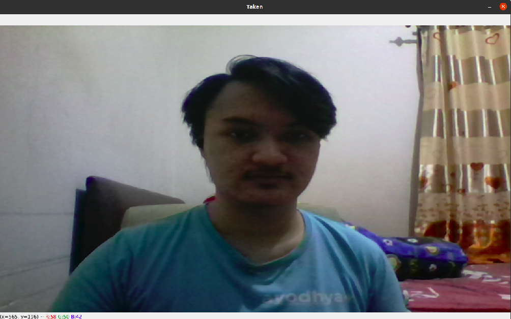
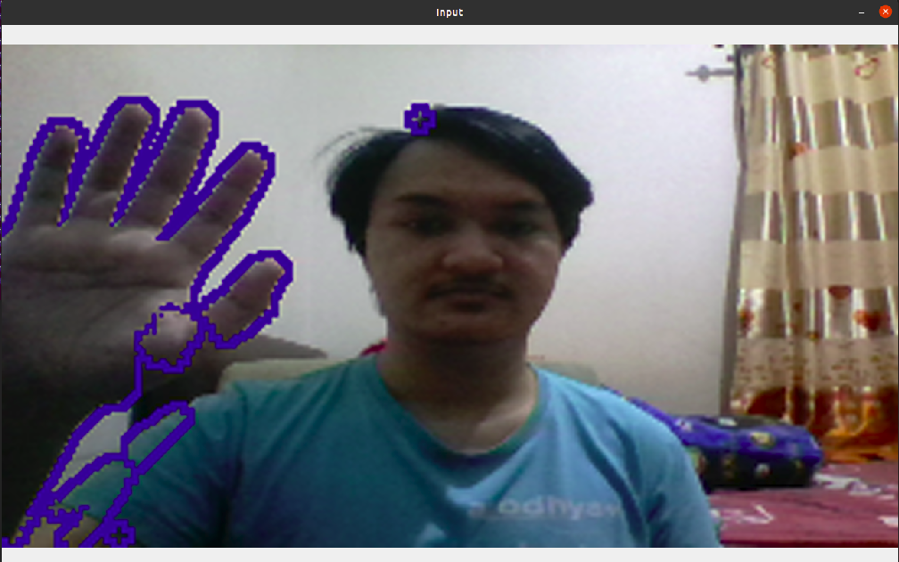

# Motion Tracking

This is a simple GUI-based application to track motion

## How to run

Clone repository :

```bash
  git clone https://github.com/Deanazor/ndflx1.git
```

Go to repository folder :

```bash
  cd ndflx1
```

I recommend you to pull this repository to make it easier to run the application later

Build docker image :

```bash
  docker build -t deanazor/motion .
```

Or, you can simply pull the image :

```bash
  docker pull deanazor/motion
```

### Run with default parameters
There is some few steps before we can run the docker image, but I've made a shell script to make it easier for you to run the docker image (which is why I recommend you to clone this repository). The default parameter is row=720, col=1280, threshold=0.75

Run image :

```bash
  sh runDocker.sh
```

### Run with custom parameters
Before you begin, you need to run the following command :

```bash
xhost +local:docker
XSOCK=/tmp/.X11-unix
XAUTH=/tmp/.docker.xauth
touch /tmp/.docker.xauth
xauth nlist $DISPLAY | sed -e 's/^..../ffff/' | xauth -f $XAUTH nmerge -
```

Then, we can start to run the image, you can check for the argument with :

```bash
docker run -it --rm --device=/dev/video0 -e DISPLAY=$DISPLAY \-v $XSOCK:$XSOCK -v $XAUTH:$XAUTH -e XAUTHORITY=$XAUTH -v ${PWD}:/src  -it deanazor/motion -h
```

After that, you should see somthing like this : 

```bash
usage: cam.py [-h] [-r ROW] [-c COL] [-t THRESHOLD]

optional arguments:
  -h, --help            show this help message and exit
  -r ROW, --row ROW     Input your desired window height
  -c COL, --col COL     Input your desired window width
  -t THRESHOLD, --threshold THRESHOLD
                        Input your desired threshold
```
If so, then we can start using the image, for example :
```bash
docker run -it --rm --device=/dev/video0 -e DISPLAY=$DISPLAY \-v $XSOCK:$XSOCK -v $XAUTH:$XAUTH -e XAUTHORITY=$XAUTH -v ${PWD}:/src  -it deanazor/motion -r 400 -c 800
```
### Actions

After the GUI pop up, you can press "T" to take background picture, "R" to reset background image, "P" to start tracking, "S" to stop tracking, and "Esc" key to close application

Note : you can't start tracking if there's no background data, and you can't take background picture while tracking

### Optional

After you've done with the image, you can run below script to return the access control

## Background and Motion Example
### Background

### Motion detected
